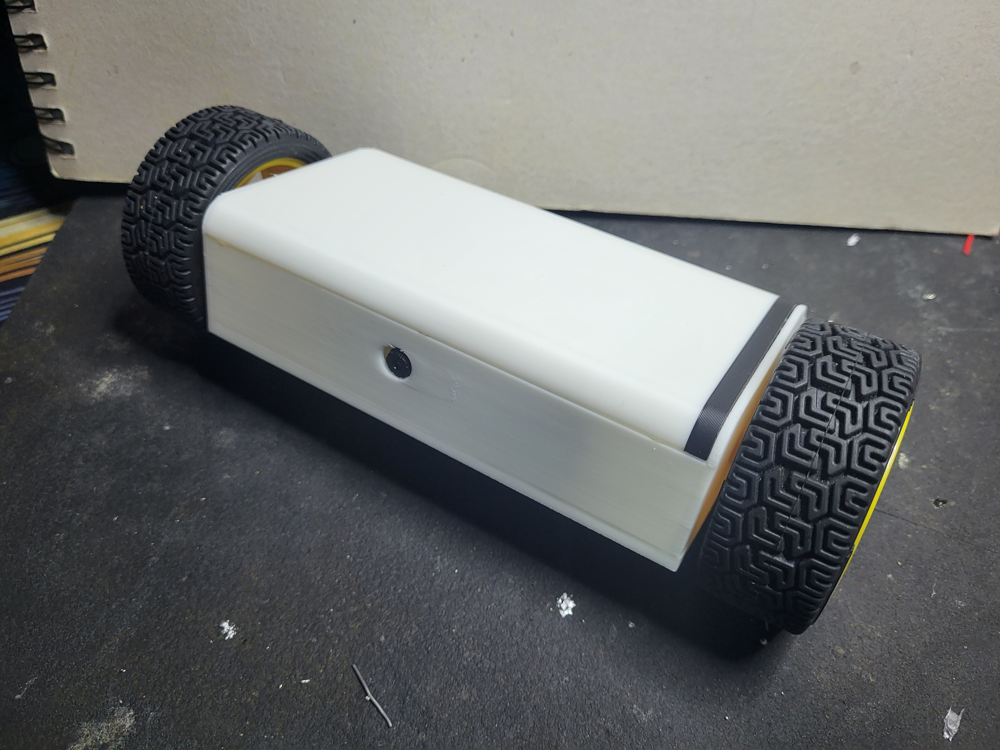
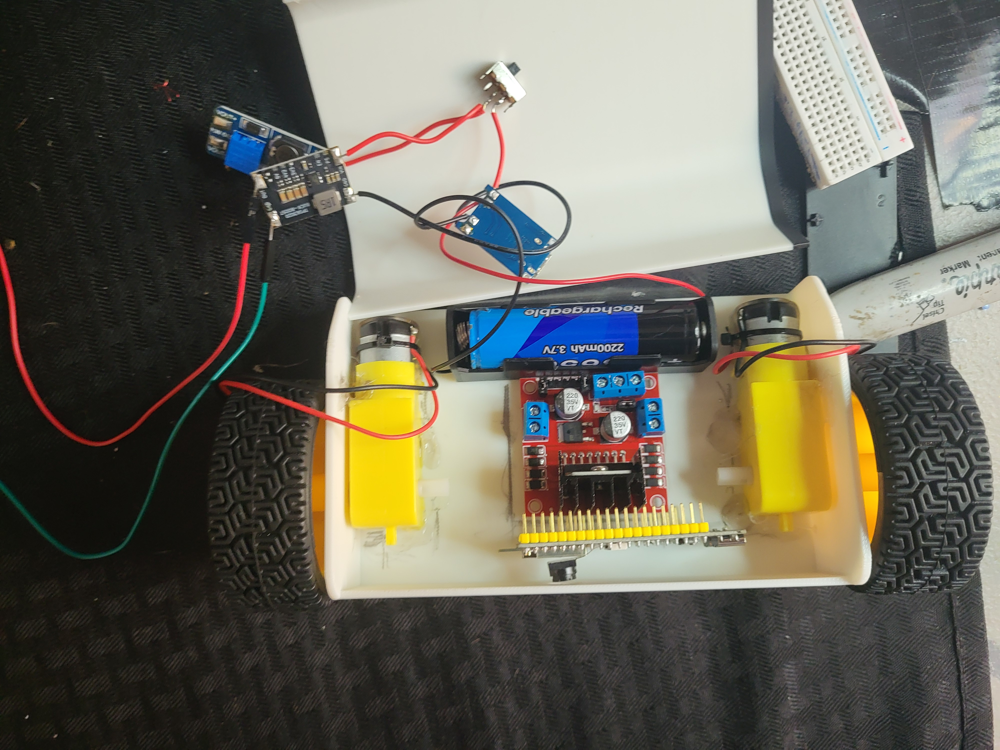

# 🛰️ ReconBot — a tactical two-wheeled recon drone

A small, sleek two-wheeled recon drone you and your kids can build together. A single
**ESP32-S3-CAM** streams live video to a web app and drives two
wheels through an **L298N** motor driver — a fixed forward-facing camera giving
you a live first-person view as you drive.

No app to install. The bot makes its own WiFi hotspot; your phone joins it and
opens a web page. Touch-and-hold the on-screen joystick to drive.


*The finished drone: printed chassis + lid, riding on salvaged car-kit wheels.*


*Inside: the L298N motor driver, MT3608 boost, 18650 cell, and the two gear motors.*

---

## What makes it cool

* **Coaxial-pendulum chassis** — both wheels share one axle line and the body
  hangs *below* the axle. Gravity keeps it upright, so there is **no balancing
  code to tune** — it's reliable on day one and still looks the part.
* **Live FPV camera** — a fixed forward-facing ESP32-S3-CAM streams video so you
  drive from the bot's point of view.
* **Tactical green-on-black HUD** — corner brackets, scanlines, live "LINK" status.

> We deliberately did **not** build a true Segway-style self-balancer. With
> salvaged car-kit gear motors, balancing is twitchy and frustrating to tune —
> the wrong first project. The pendulum design gives the same sleek look with
> none of the pain. See [docs/04_LEARN.md](docs/04_LEARN.md) for the physics.

---

## What you need

Most of this is common hobby-electronics stock — a lot of it can be salvaged
from an Arduino starter/car kit.

| Part | Qty | Role |
|---|---|---|
| ESP32-S3-CAM (FORIOT, OV3660) | 1 | camera + brain + WiFi + control |
| L298N dual H-bridge | 1 | drives the two wheels |
| 2× DC gear motors + wheels | 2 | drive (salvage from a toy car kit) |
| MPU-6050 IMU *(optional)* | 1 | tilt read-out on the HUD (later) |
| 18650 cell + holder | 1 | power |
| TP4056 (USB-C, protected) | 1 | charge + protect the cell |
| TPS63020 buck/boost (3.3 V) | 1 | clean power for the brain |
| MT3608 boost | 1 | 5 V for the motors |
| Rocker switch | 1 | on/off |
| Jumper wire / hookup wire | — | wiring |
| 3D-printed chassis + lid | 1 set | body (STLs included; wheels are the car-kit's) |

Full mapping + quantities: [hardware/BOM.md](hardware/BOM.md).

---

## How it's powered (quick view)

One 18650 cell, two converters — the brain and the motors are kept on
**separate power rails** so motor noise can't reset the camera (the #1 thing
that frustrates beginners).

```
18650 ─► TP4056 (charge/protect) ─► switch ─┬─ TPS63020 → 3.3V → ESP32-S3-CAM (brain)
                                            └─ MT3608   → 5.0V → L298N motor driver (muscle)
```

Full diagram + every wire: [docs/02_WIRING_GUIDE.md](docs/02_WIRING_GUIDE.md).

---

## Quick start (5 steps)

1. **Print the parts** — [hardware/3D_PRINTING.md](hardware/3D_PRINTING.md).
2. **Flash the firmware** — open [firmware/reconbot/reconbot.ino](firmware/reconbot/reconbot.ino)
   in the Arduino IDE, set the board options listed at the top of that file
   (the proven board settings — TTL port, OPI PSRAM, CDC Disabled, 115200),
   and upload.
3. **Wire it up** — follow [docs/02_WIRING_GUIDE.md](docs/02_WIRING_GUIDE.md).
4. **Connect your phone** — join WiFi **`ReconBot`** (default password
   `changeme123` — set your own in `config.h`), open Safari to
   **`http://192.168.4.1`**.
5. **Drive** — touch-hold the on-screen joystick to drive while you watch the
   live video feed.

Start to finish, step by step: [docs/01_BUILD_GUIDE.md](docs/01_BUILD_GUIDE.md).

---

## Project layout

```
reconbot/
├── README.md                  ← you are here
├── firmware/reconbot/         ← the code that runs on the ESP32-S3-CAM
│   ├── reconbot.ino           ← main program
│   ├── config.h               ← EDIT THIS: WiFi, pins, tuning
│   ├── camera_pins.h          ← camera pin map (verify vs your board)
│   └── web_index.h            ← the phone web app (HTML/CSS/JS)
├── docs/
│   ├── 01_BUILD_GUIDE.md      ← full step-by-step assembly
│   ├── 02_WIRING_GUIDE.md     ← pinouts, power tree, every connection
│   ├── 03_TROUBLESHOOTING.md  ← when something doesn't work
│   └── 04_LEARN.md            ← how it all works (the educational part)
├── hardware/
│   ├── BOM.md                 ← bill of materials
│   └── 3D_PRINTING.md         ← what to print + slicer settings
└── freecad/                   ← print-ready STLs (chassis + lid)
    ├── drone_chassis.stl
    └── drone-lid.stl
```

---

## Safety (read this with your son)

* **LiPo/Li-ion cells are not toys.** Never short the 18650, charge only on the
  TP4056, never leave charging unattended, never puncture a cell.
* **Power off (switch) before plugging in USB** to program, so two power sources
  don't fight.
* **Wheels off the ground** the first time you test motors.
* Double-check **+ and −** before switching on. Reversed power kills boards.

Have fun. 🟢

---

## License

Released under the [MIT License](LICENSE) — free to use, modify, and share.
Built as a father-and-son learning project; if you build your own, have fun
and stay safe with the battery.
